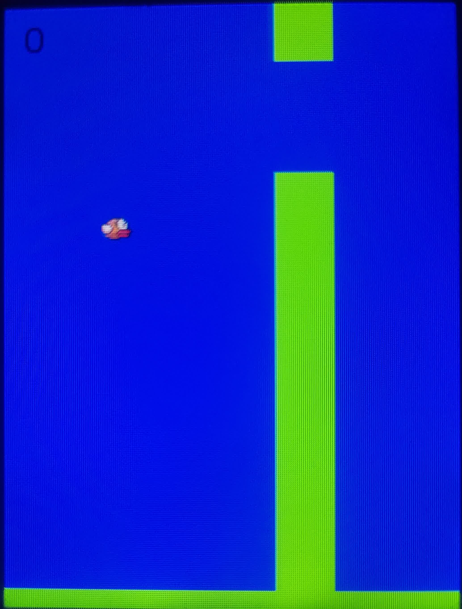

# Flappy Bird Clone for MRE Platform



## About

A lightweight implementation of the popular Flappy Bird game for MediaTek MRE platform, designed to run on feature phones with limited resources.
Tested on Nokia 225.

## Controls

- Any keypress (typically center or OK button): Make the bird flap/jump
- When game over, press any key to restart

## Building the Project

### Prerequisites

- ARM GCC toolchain (arm-none-eabi-gcc)

### Compilation

- Run
```bash
make
```

This will produce a `.vxp` file in the build directory that can be installed on MRE-compatible phones.
You can also download a pre-built version from the [latest release](https://github.com/ysdragon/flappybird.vxp/releases/latest).

## License
This project is open source and available under the [MIT License](LICENSE).